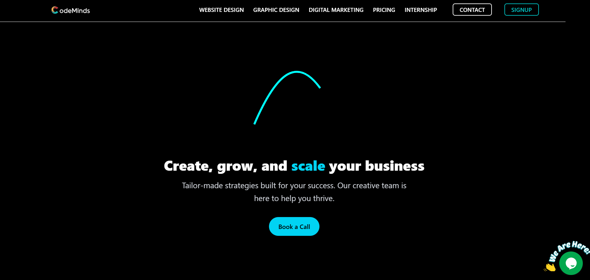
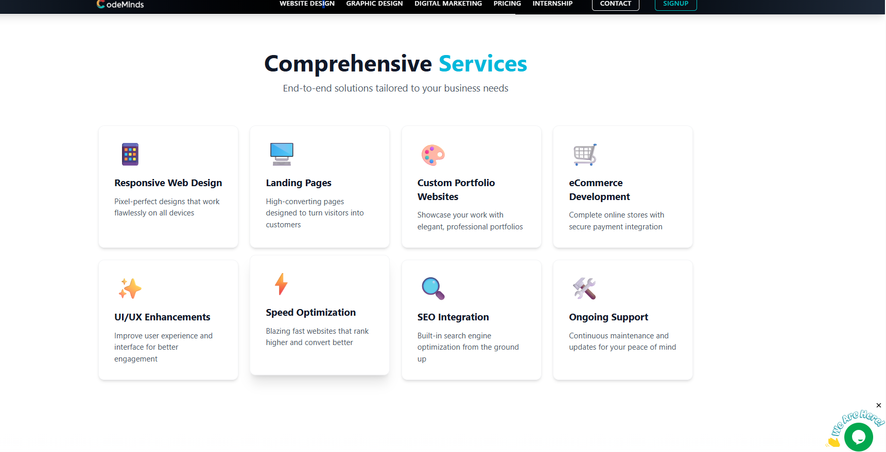
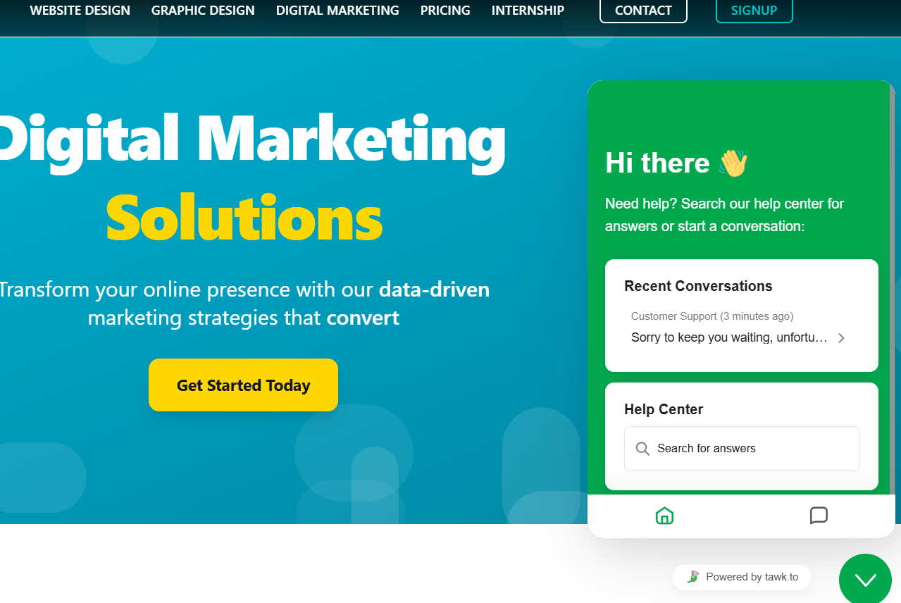

# CodeMinds Web Services – Build. Design. Grow.



---

## About the Project

**CodeMinds Web Services** is a full-service digital agency helping businesses establish their online presence through premium **website design**, **graphic design**, and **digital marketing**. Our mission is to create tailored strategies that help brands grow, convert, and stand out in the digital space.

This project showcases our business website built using **React** and powered by **Bun**. It features a live chatbot, dynamic project portfolio, client success stories, and service offerings.

---

## Features



- 💼 Project showcase for clients like **Knowvity**, **Radhika Fashion**, and **Vijayaa Makeovers**
- 🎨 Full-stack design services including logo, branding, packaging, UI/UX
- 🌐 Digital marketing solutions: SEO, social media, email campaigns
- 💬 **Live chatbot** integration for real-time visitor support
- ⚙️ Built with modern stack: React, Bun, Tailwind, MongoDB
- 🧠 Animated components, responsive layouts, and lightning-fast performance

---

## 💬 Chatbot Integration

Our website includes a fully functional **live support chatbot** that helps users:

- Get instant answers  
- Book consultations  
- Ask about pricing or services  
- Submit project inquiries  



The chatbot enhances user engagement and provides 24/7 assistance to visitors, improving conversion and customer support.

---

## Tech Stack

- **React** – Component-based frontend UI  
- **Bun** – Ultra-fast JS runtime & bundler  
- **Tailwind CSS** – Utility-first CSS  
- **Chat Widget Integration** – Third-party or custom chatbot  

---

## Getting Started

To run this project locally:

### 1. Clone the repository

```bash
git clone https://github.com/komalkumarpalwai/codemindsweb.git
cd codemindsweb
2. Install dependencies (using Bun)
bash
Copy code
bun install
3. Run the development server
bash
Copy code
bun run dev
Visit: http://localhost:3000

4. Build for production
bash
Copy code
bun run build
5. Preview the production build
bash
Copy code
bun run preview
🚀 Live Demo
Check out the live website here:
🔗 https://www.codemindswebservices.com

